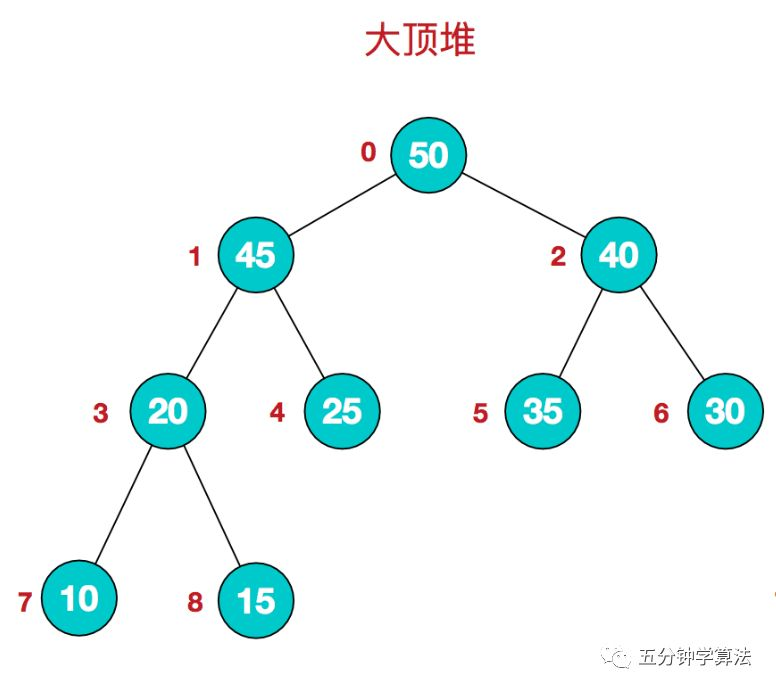

# 算法

## 排序算法

排序算法可以分为 **内部排序** 和 **外部排序**

内部排序是数据记录在内存中进行排序。

而外部排序是因排序的数据很大，一次不能容纳全部的排序记录，在排序过程中需要访问外存。

常见的内部排序算法有： 插入排序、希尔排序、选择排序、冒泡排序、归并排序、快速排序、堆排序、基数排序...

用一张图该概括：

|排序算法|平均时间复杂度|最好情况|最坏情况|空间复杂度|排序方式|稳定性|
|---|---|---|---|---|---|---|
|冒泡排序|O(n²)|O(n)|O(n²)|O(1)|In-place|稳定|
|选择排序|O(n²)|O(n²)|O(n²)|O(1)|In-place|不稳定|
|插入排序|O(n²)|O(n)|O(n²)|O(1)|In-place|稳定|
|希尔排序|O(n log n)|O(n log² n)|O(n log² n)|O(1)|In-place|不稳定|
|归并排序|O(n log n)|O(n log n)|O(n log n)|O(n)|Out-place|稳定|
|快速排序|O(n log n)|O(n log n)|O(n²)|O(log n)|In-place|不稳定|
|堆排序|O(n log n)|O(n log n)|O(n log n)|O(1)|In-place|不稳定|
|计数排序|O(n + k)|O(n + k)|O(n + k)|O(k)|Out-place|稳定|
|桶排序|O(n + k)|O(n + k)|O(n²)|O(n + k)|Out-place|稳定|
|基数排序|O(n x k)|O(n x k)|O(n x k)|O(n + k)|Out-place|稳定|

<center>时间复杂度和空间复杂度</center>

**关于时间复杂度：**

* 平方阶(O(n²))排序各类简单排序：直接插入、直接选择排序和冒泡排序。
* 线性对数阶(O(nlog2n))排序 快速排序、堆排序和归并排序。
* O(n1+∮)排序，∮是介于0和1之间的常数。 希尔排序。
* 线性阶(O(n))排序 基数排序，此外还有桶、箱排序。

**关于稳定性：**

* 稳定的排序算法： 冒牌排序、插入排序、归并排序和基数排序。
* 不是稳定的排序算法： 选择排序、快速排序、希尔排序、堆排序。


> 1. 冒牌排序

### 1.1 算法步骤

**描述：** 冒泡排序(Bubble Sort)也是一种简单直观得排序算法。它重复地走访过要排序得数列，一次比较两个元素，如果他们的顺序错误就把他们交换过来。走访数列的工作是重复的进行直到没有再需要交换，也就是说该数列已经排序完成。这个算法的名字由来是因为越小的元素会经由交换慢慢"浮"到数列的顶端。

* 比较相邻的元素。如果第一个比第二个大，就交换他们两。
* 对每一对相邻的元素。如果第一个比第二个大，就交换他们两个。
* 对每一对相邻做同样的工作，从开始第一对到结尾的最后一对。这步做完后，最后的元素会使最大的数
* 针对所有的元素重复以上的步骤，除了最后一个。
* 持续每次对越来越少的元素重复上面的步骤，直到没有任何一对数字需要比较。

###1.2 动画演示


<center>冒泡动画演示</center>

###1.3 参考代码

```java
   int[] arr = {1, 3, 5123, 566, 123, 51};
        /**
         *比较轮数
         */
        for (int i = 1; i < arr.length; i++) {
            /**
             * 比较次数 外层循环一次 内层循环所有
             * 过程 取到第一个数 去和后面的依次数比较  比后面的数大则交换位置（所有不用比较最后一个数 这就是轮数比数组长度少一的原因）
             */
            for (int j = 0; j < arr.length - i; j++) {
                if (arr[j] > arr[j + 1]) {
                    int tmp = arr[j];
                    arr[j] = arr[j + 1];
                    arr[j + 1] = tmp;
                }
            }
        }
        Arrays.stream(arr).forEach(System.out::println);

```

>2.选择排序

###2.1 算法步骤

**描述:** 选择排序是一种简单直观的排序算法，无论什么数据进去都是O(n²)大的时间复杂度。所以用到它的时候，数据规模越小越好。唯一的好处可能就是不用占用额外的内存空间了吧。

* 首先在未排序序列中找到最小(大)元素，存放到排序序列起始位置
* 在从剩余未排序元素中继续寻找最小(大)元素，然后放到已排序序列的末尾
* 重复第二步，直到所有元素均排序完毕。

###2.2 动画演示


<center>选择排序动画演示</center>

###2.3参考代码

```java
    int[] arr = {1, 3, 5123, 566, 123, 51};
      /**
         * 总共要经过 N-1 轮比较
         */
        for (int i = 0; i < arr.length; i++) {
            int min = i;
            for (int j = arr.length-1; j>0+i ; j--) {
                if (arr[min] > arr[j]) {
                    min = j;
                }
            }
            int tmp = arr[i];
            arr[i] = arr[min];
            arr[min] = tmp;
        }
        Arrays.stream(arr).forEach(System.out::println);
        //第一个的缺点。操作数组频繁导致效率低

        /**
         * 总共要经过 N-1 轮比较
         */
        for (int i = 0; i < arr.length - 1; i++) {
            int min = i;
            /**
             *  每轮需要比较的次数 N-i
             */
            for (int j = i + 1; j < arr.length; j++) {
                if (arr[min]>arr[j]){
                    // 记录目前能找到的最小值元素的下标
                    min = j;
                }
                // 将找到的最小值和i位置所在的值进行交换
                if (min != i) {
                    int tmp = arr[min];
                    arr[min] = arr[i];
                    arr[i] = tmp;
                }
            }
        }
        Arrays.stream(arr).forEach(System.out::println);

```

>3.插入排序

###3.1 算法步骤

**描述:** 插入排序的代码实现虽然没有冒泡排序和选择排序那么简单粗暴，但它的原理应该是最容易理解的了，因为只要打过扑克牌的人都应该能够秒懂。插入排序是一种最简单直观的排序算法，它的工作原理是通过构建有序序列，对于未排序数据，在已排序序列钟从后向前扫描，找到相应位置并插入

* 将第一待排序序列第一个元素看做一个有序序列，把第二个元素到最后一个元素当成是未排序序列。
* 从头到尾依次扫描未排序序列，将扫描到的每个元素插入有序序列的适当位置。(如果待插入的元素与有序序列的某个元素相等，则将插入元素插入到相等元素的后面。)

###3.2 动画演示


<center>插入排序动画演示</center>

###3.3 参考代码

```java
  int[] arr = {4, 3, 5123, 566, 123, 51};
        /**
         * 从下标为1的元素开始选择合适的位置插入，因为下标为0的只有一个元素，默认是有**序的
         */
        for (int i = 1; i < arr.length; i++) {
             // 记录要插入的数据
            int tmp = arr[i];
             // 从已经排序的序列最右边的开始比较，找到比其小的数
            int j = i;
            while (j > 0 && arr[j] < arr[j - 1]) {
                arr[j] = arr[j-1];
                arr[j - 1] = tmp;
                j--;
            }
        }
        Arrays.stream(arr).forEach(System.out::println);

        //第一个的缺点，只要后一个比前一个小，就插入。插入频繁导致效率低

         // 从下标为1的元素开始选择合适的位置插入，因为下标为0的只有一个元素，默认是有序的
        for (int i = 1; i < arr.length; i++) {

            // 记录要插入的数据
            int tmp = arr[i];

            // 从已经排序的序列最右边的开始比较，找到比其小的数
            int j = i;
            while (j > 0 && tmp < arr[j - 1]) {
                arr[j] = arr[j - 1];
                j--;
            }
            // 存在比其小的数，插入
            if (j != i) {
                arr[j] = tmp;
            }
        }
        Arrays.stream(arr).forEach(System.out::println);
```

>4.希尔排序

###4.1 算法步骤

**描述:** 希尔排序，也称递减增量排序算法，是插入排序的一种更高效的改进版本。但希尔排序是非稳定排序算法。

* 希尔排序是基于插入排序的以下两点性质提出改进方法的：
* * 插入排序在对几乎已经排好序的数据操作时，效率高，即可以达到线性排序的效率；
* * 但是插入排序一般来说是低效的，因此插入排序每次只能将数据移动一位；
* 希尔排序的基本思想是：先将整个待排序的记录序列分割成为若干子序列分别进行直接插入排序，待整个序列中的记录“基本有序”时，再对全体记录进行依次直接插入排序。

* 选择一个增量序列t1,t2,....,tk,其中ti>tj,tk=1。
* 按增量序列个数k，对序列进行k趟排序。
* 每趟排序，根据对应的增量ti，将待排序列分割成若干长度为m的子序列，分别对各个表进行直接插入排序。仅增量因子为1时，整个序列作为一个表来处理，表示长度即为整个序列的长度。

###4.2 动画演示


<center>希尔排序动画演示</center>

###4.3 参考代码

```java
  int gap = 1;
        while (gap < arr.length) {
            gap = gap*3 + 1;
        }
        while (gap > 0) {
            for (int i = gap; i < arr.length; i++) {
                int tmp = arr[i];
                int j = i - gap;
                while (j >= 0 && arr[j] > tmp) {
                    arr[j + gap] = arr[j];
                    j -= gap;
                }
                arr[j + gap] = tmp;
            }
            gap = (int) Math.floor(gap / 3);
        }
        Arrays.stream(arr).forEach(System.out::println);
        //分组插入思想，数组越有序效率越高
```

>5.归并排序

###5.1 算法步骤

**描述:**归并排序(Merge sort)是建立在归并操作上的一种有效的排序算法。该算法采用分治法(Divide and Conquer)的一个非常典型的应用。

* 作为一种典型的分而治之思想的算法应用，归并排序的实现由两种方法:
* * 自上而下的递归(所有递归的方法都可以用迭代重写，所以就有了第2钟方法)
* * 自下而上的迭代；
* 和选择排序一样，归并排序的性能不受输入数据的影响，但表现比选择排序好的多，因为始终都是O(nlogn)的时间复杂度。代价是需要额外的内存空间。

* 申请空间，使其大小为两个已经排序序列之和，该空间用来存放合并后的序列
* 设定两个指针，最初位置分别为两个已经排序序列的起始位置
* 比较两个指针所指向的元素，选择相对小的元素放入到合并空间，并移动指针到下一位置
* 重复步骤3直到某一指针达到序列列尾
* 将另一序列剩下的所有元素直接复制到合并序列列尾


###5.2 动画演示


<center>归并排序动画演示</center>

###5.3 参考代码

```java
  public static void main(String[] args) {
        int[] arr = {4, 3, 5123, 566, 123, 51};
        if (arr.length < 2) {
            return;
        }
        int middle = (int) Math.floor(arr.length / 2);
        int[] left = Arrays.copyOfRange(arr, 0, middle);
        int[] right = Arrays.copyOfRange(arr, middle, arr.length);
        Arrays.sort(left);
        Arrays.sort(right);
        int[] result = merge(left, right);
        Arrays.stream(result).forEach(System.out::println);
    }

    /**
     * 两个有序数组
     * @param left
     * @param right
     * @return
     */
    public static int[] merge(int[] left, int[] right) {
        int[] result = new int[left.length + right.length];
        int i = 0;
        while (left.length > 0 && right.length > 0) {
            if (left[0] <= right[0]) {
                result[i++] = left[0];
                left = Arrays.copyOfRange(left, 1, left.length);
            } else {
                result[i++] = right[0];
                right = Arrays.copyOfRange(right, 1, right.length);
            }
        }
        while (left.length > 0) {
            result[i++] = left[0];
            left = Arrays.copyOfRange(left, 1, left.length);
        }
        while (right.length > 0) {
            result[i++] = right[0];
            right = Arrays.copyOfRange(right, 1, right.length);
        }
        return result;
    }
```

>6.快速排序

###6.1 算法步骤

**描述:**快速排序是有东尼·霍尔所发展的一种排序算法。在平均状况下，排序n个项目要O(nlogn)次比较。在最坏状况下需要O(n²)次比较，但这种情况并不常见。事实上，快速排序通常明显比其他O(nlogn)算法更快，因为它的内部循环(inner loop)可以在大部分的架构上很有效率的被实现出来。

快速排序使用分治法(Divide and conquer)策略来把一个串行(list)分为两个子串行(sub-lists).

快速排序又是一种分而治之思想在排序算法上的典型应用。本质上来看，快速排序应该算是在冒泡排序基础上的递归分治法。

* 从数列中挑出一个元素，称为`基准`(pivot)
* 重新排序数列，所有元素比基准值小的摆放在基准前面，所有元素比基准值大的摆在基准的后面(相同数可以到任一边)。在这个分区退出之后，该基准就处于数列的中间位置。这个称为分区(partition)操作
* 递归地(recursive)把小于基准值元素的子列数和大于基准值元素的子数列排序

###6.2 动画演示


<center>快速排序动画演示</center>

###6.3 参考代码

```java
 public static void main(String[] args) {
        int[] arr = {4, 3, 5123, 51, 123, 1};
        quickSort(arr, 0, arr.length - 1);
        Arrays.stream(arr).forEach(System.out::println);
    }

    public static void quickSort(int[] arr, int left, int right) {
        if (left < right) {
            int partitionIndex = partition(arr, left, right);
            quickSort(arr, left, partitionIndex - 1);
            quickSort(arr, partitionIndex + 1, right);
        }
    }

    private static int partition(int[] arr, int left, int right) {
        //设定基准值(pivot)
        int pivot = left;
        int index = pivot + 1;
        for (int i = index; i <= right; i++) {
            if (arr[i] < arr[pivot]) {
                /**
                 * 找到要排序的数组中小于几尊值得（优先级从后向前降低）数和基准值正确的位置交换
                 * 比如 arr[pivot]=4 则基准值的正确位置为arr[2]=5123
                 * 数组中最后为arr[5]=1优先级最高  则 交换
                 * 交换后为arr[2]=1   arr[5]=5123
                 */
                swap(arr, i, index);
                /**
                 * 记录基准值正确位置
                 */
                index++;
            }
        }
        /**
         * 上边已经找到了基准值的正确位置
         * 而基准值位置上的数是根据优先级比基准值小的数
         * 则此次交换 则完成两个数的定位  基准值  比基准值小的数
         */
        swap(arr, pivot, index - 1);
        return index - 1;
    }

    private static void swap(int[] arr, int i, int j) {
        int temp = arr[i];
        arr[i] = arr[j];
        arr[j] = temp;
    }
```

>7.堆排序

###7.1 堆结构

堆是具有以下性质的完全二叉树：
* 每个节点的值都大于或等于其左右节点的值，称为大堆顶
* 每个节点的值都小于或等于其左右孩子节点的值，称为小堆顶




###7.2 堆排序

堆排序(HeapSort)是指利用堆这种数据结构所设计的一种排序算法。堆积是一个近似完全二叉树的机构，并同时满足堆积的性质：即子节点的键值或索引总是小于(或者大于)它的父节点。堆排序可以说是一种利用堆的概念来排序的选择排序。分为两种方法：
* 大堆顶：每个节点的值都大于或等于其子节点的值，在堆排序算法中用于升序排列；
* 小堆顶：每个节点的值都小于或等于其子节点的值，在堆排序算法中用于降序排列；

堆排序的平均时间复杂度未O(nlogn)

###7.3 算法步骤

* 创建一个堆H[0......n-1]。
* 把堆首(最大值)和堆尾互换。
* 把堆得尺寸缩小1，并调用shift_down(0),目的是把新的数组顶端数据调整到相应位置。
* 重复步骤2，直到堆得尺寸为1。


###7.4 动画演示


<center>堆排序动画演示</center>

###7.5 参考代码

```java
 public static void main(String[] args) {
        int[] arr = {4, 3, 5123, 51, 123, 1};
        int length = arr.length;
        buildMaxHeap(arr, length);
        for (int i = length - 1; i > 0; i--) {
            swap(arr, 0, i);
            length--;
            heapify(arr,0,length);
        }
        Arrays.stream(arr).forEach(System.out::println);
    }

    private static void buildMaxHeap(int[] arr, int length) {
        for (int i = (int) Math.floor(length / 2); i >= 0; i--) {
            heapify(arr, i, length);
        }
    }

    private static void heapify(int[] arr, int i, int length) {
        int left = 2*i+1;
        int right = 2*i+2;
        int largest = i;
        if (left < length && arr[left] > arr[largest]) {
            largest = left;
        }
        if (right < length && arr[right] > arr[largest]) {
            largest = right;
        }
        if (largest != i) {
            swap(arr, i, largest);
            heapify(arr, largest, length);
        }
    }

    private static void swap(int[] arr, int i, int j) {
        int temp = arr[i];
        arr[i] = arr[j];
        arr[j] = temp;
    }
```

>8.计数排序

**描述：**计数排序是一种非基于比较的排序算法，其空间复杂度和时间复杂度均为O(n+k),其中k是整数的范围。基于比较的排序算法时间复杂度最小是O(nlogn)的。该算法于1954年由Harold H. Seward提出。

计数排序的核心在于将输入的数据值转化为键存储在额外开辟的数组空间中。作为一种线性时间复杂度的排序，计数排序要求输入的数据必须是有`确定范围的整数`


### 8.1 算法步骤

* 花O(n)的时间扫描一下整个序列A，获取最小值min和最大值max
* 开辟一块新的空间创建新的数组B，长度为(max-min+1)
* 数组B中index的元素记录的值是A中某个元素出现的次数
* 最后输出目标整数序列，具体的逻辑是遍历数组B，输出相应元素以及对应的个数

###8.2 动画演示


<center>计数排序动画演示</center>

###8.3 参考代码

```java
 public static void main(String[] args) {
        int[] arr = {4, 3, 5123, 51, 123, 1};
        int maxValue = getMaxValue(arr);
        countingSort(arr, maxValue);
        Arrays.stream(arr).forEach(System.out::println);
    }

    /**
     * 数组最大值越大越浪费得空间，感觉用于统计数字出现次数比较好用
     * @param arr
     * @param maxValue
     */
    private static void countingSort(int[] arr, int maxValue) {
        int bucketLen = maxValue + 1;
        int[] bucket = new int[bucketLen];

        for (int value : arr) {
            bucket[value]++;
        }
        int sortedIndex = 0;
        for (int j = 0; j < bucketLen; j++) {
            while (bucket[j] > 0) {
                arr[sortedIndex++] = j;
                bucket[j]--;
            }
        }

    }

    private static int getMaxValue(int[] arr) {
        int maxValue = arr[0];
        for (int value : arr) {
            if (maxValue < value) {
                maxValue = value;
            }
        }
        return maxValue;
    }
```

>9.桶排序

**描述：**桶排序(Bucket sort)是一种基于计数的排序算法，工作的原理是将数据分到有限数量的桶子里，然后每个桶再分别排序(有可能再使用别的排序算法或是以递归方式继续使用桶排序进行排序)

###9.1 算法步骤

* 设置固定数量的空桶
* 把数据放到对应的桶中
* 对每个不为空的桶中数据进行排序
* 拼接不为空的桶中数据，得到结果

###9.2 动画演示


<center>桶排序动画演示</center>

###9.3 参考代码

```java
public static void main(String[] args) {
        int[] arr = {4, 3, 5123, 51, 123, 1};
        bucketSort(arr, 5);
        Arrays.stream(arr).forEach(System.out::println);
    }

    private static void bucketSort(int[] arr, int bucketSize) {
        if (arr.length == 0) {
            return;
        }
        int minValue = arr[0];
        int maxValue = arr[0];
        for (int value : arr) {
            if (value < minValue) {
                minValue = value;
            } else if (value > maxValue) {
                maxValue = value;
            }
        }
        int bucketCount = (int) Math.floor((maxValue - minValue) / bucketSize) + 1;
        int[][] buckets = new int[bucketCount][0];

        /**
         * 利用映射函数将数据分配到各个桶中
         */
        for (int i = 0; i < arr.length; i++) {
            int index = (int) Math.floor((arr[i] - minValue) / bucketSize);
            buckets[index] = arrAppend(buckets[index], arr[i]);
        }

        int arrIndex = 0;
        for (int[] bucket : buckets) {
            if (bucket.length <= 0) {
                continue;
            }
            /**
             * 插入排序
             */
            bucket = insertSort(bucket);
            for (int value : bucket) {
                arr[arrIndex++] = value;
            }
        }

    }

    private static int[] insertSort(int[] arr) {
        for (int i = 1; i < arr.length; i++) {
            int temp = arr[i];
            int j = i;
            while (j > 0 && temp < arr[j - 1]) {
                arr[j] = arr[j - 1];
                j--;
            }
            if (j != i) {
                arr[j] = temp;
            }
        }
        return arr;
    }
```

>10.基数排序

**描述:**基数排序(Radix Sort)是一种非比较型排序算法，其原理是将整数按位数切割成不同的数字，然后按每个位数分别比较。基数排序的发明可以追溯到1887年赫尔曼·何乐礼在打孔卡片制表机(Tabulation Machine)上的贡献。

基数排序法会使用到桶(Bucket),顾名思义，通过将要比较的位(个位，十位，百位...),将要排序的元素分配至0~9个桶中，借以达到排序的作用，在某些时候，基数排序法的效率高于其它的比较性排序法。


###10.1 算法步骤

* 将所有待比较数值(正整数)统一为同样的数位长度，数位较短的数前面补零
* 从最低位开始，依次进行一次排序
* 从最低位排序一直到最高位排序完成以后，数列就变成一个有序序列
* 

###10.2 动画演示


<center>基数排序动画演示</center>

###10.3 参考代码

```java
    public static void main(String[] args) {
        int[] arr = {4, 3, 5123, 51, 123, 1};
        int maxDigit = getMaxDigit(arr);
        radixSort(arr, maxDigit);
        Arrays.stream(arr).forEach(System.out::println);
    }

    private static void radixSort(int[] arr, int maxDigit) {
        int mod = 10;
        int dev = 1;

        for (int i = 0; i < maxDigit; i++, dev *= 10, mod *= 10) {
            //考虑复数的情况，这里扩展一倍队列数，其中[0-9]对应复数，[10-19]对应正数(bucket+10)
            int[][] counter = new int[mod * 2][0];

            for (int j = 0; j < arr.length; j++) {
                int bucket = ((arr[j] % mod) / dev) + mod;
                counter[bucket] = arrAppend(counter[bucket], arr[j]);
            }
            int pos = 0;
            for (int[] bucket : counter) {
                for (int value : bucket) {
                    arr[pos++] = value;
                }
            }

        }
    }

    /**
     * 自动扩容，保存数据
     * @param bucket
     * @param i
     * @return
     */
    private static int[] arrAppend(int[] bucket, int i) {
        bucket = Arrays.copyOf(bucket, bucket.length + 1);
        bucket[bucket.length - 1] = i;
        return bucket;
    }
    /**
     * 获取最高位
     * @param arr
     * @return
     */
    private static int getMaxDigit(int[] arr) {
        int maxValue = getMaxValue(arr);
        return getNumLength(maxValue);

    }

    private static int getNumLength(int num) {
        if (num == 0) {
            return 1;
        }
        int length = 0;
        for (int temp = num; temp != 0; temp /= 10) {
            length++;
        }
        return length;
    }

    private static int getMaxValue(int[] arr) {
        int maxValue = arr[0];
        for (int value : arr) {
            if (maxValue < value) {
                maxValue = value;
            }
        }
        return maxValue;
    }
```


